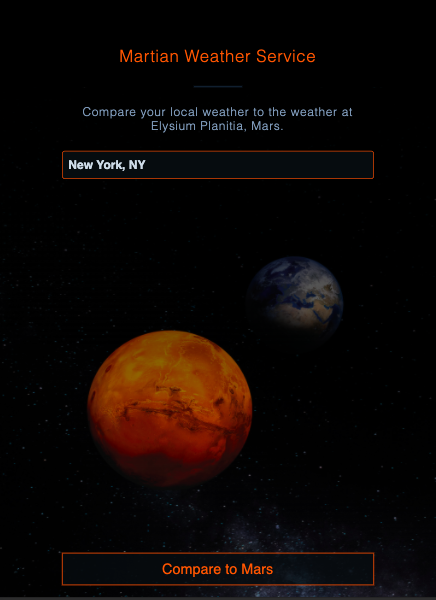
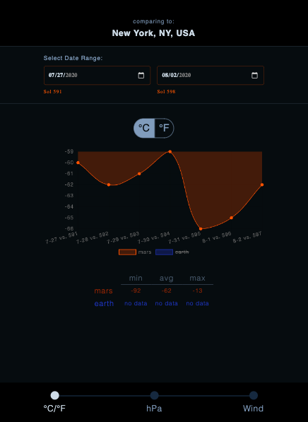

# Martian Weather Service

## Demo

Live demo can be found [here.](https://bradforddean1.github.io/martian-weather-service/.)

## Summary

Martian Weather Service takes a location inout by the end user and compares availbale weather data from that location with the weather at Elysium Planitia, Mars. Martian weather data is provided by the NASA InSight lander which takes daily weather measurements (temperature, wind, pressure) on the surface of Mars at Elysium Planitia, a flat, smooth plain near Mars’ equator. Additional info con the Insight Mission can be found [here](https://mars.nasa.gov/insight/spacecraft/about-the-lander/).

After providing a location, a comparison is avaiaoble for temperature, wind, pressure as avaialble. User can look at Terran only and Mars only data as well. The user can select the time frame from which to comare data. UNfortunately at this time, only the last seven days of data is available. User can choose to view the data in Metric or US Customary units of measure. High, Low, and Average temperature over the period selected is provided in tabualr form. The rendered graph shows data on the average only.

## Technology

HTML/CSS/JavaScript/jQuery
